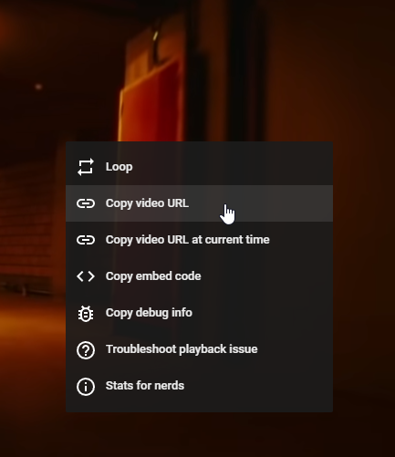
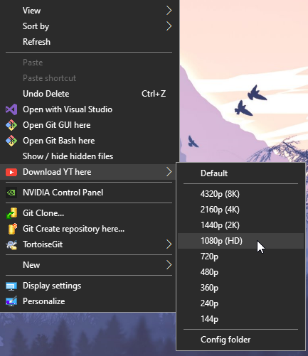

Simple integration of **[yt-dlp](https://github.com/yt-dlp/yt-dlp)** into the context menu of **Windows Explorer**.


## Installation

0. **[Python >=3.8](https://www.python.org/downloads/)** must be installed and added to the PATH.
1. Clone or download .zip of repo.
2. Unpack it somewhere it shouldn't be removed from.
3. Run `windows/install.bat` as administrator.
4. ***(Optional)*** Copy `thirdparty/phantomjs.exe` somewhere with PATH. (For example, in the root directory of Python).


## Uninstallation

Run `windows/uninstall.reg`


## How it's working

The script downloads all video links from the clipboard.

1. Copy the link(s).
2. Right-click where you want to download it. Select the desired quality.

<p align="left">
    
    
</p>


## Configuration

[Options of yt-dlp](https://github.com/yt-dlp/yt-dlp#usage-and-options) and [output format](https://github.com/yt-dlp/yt-dlp#output-template) can be changed by modifying `config.py`

```python
# 4320 2160 1440 1080 720 480 360 240 144
DEFAULT_RESOLUTION = 1080

# Output template: https://github.com/yt-dlp/yt-dlp#output-template
SINGLE_FILE    = "%(title)s.%(ext)s"
MULTIPLE_FILES = "%(autonumber)s. %(title)s.%(ext)s"


# yt-dlp (youtube-dl) options
# Options: https://github.com/yt-dlp/yt-dlp#usage-and-options
OPTS = [ 
    '--ignore-errors',
    '--no-check-certificates',
    '--embed-thumbnail',
    '--write-subs',
    #'--write-auto-subs',
    '--sponsorblock-remove', 'sponsor',
    '--sub-langs', (',').join(["ru", "en", "en-us"]),

    # rtmp/rstp/mms streams
    #'--downloader', 'ffmpeg'
    #'--downloader-args', 'ffmpeg:-loglevel error'
]
```


## Tips

- It works with playlists.
- It works with multiple video links separated by newlines or commas.
- Works not only with YouTube, but also with Vimeo, TikTok, etc.
- YouTube sometimes breaks its API to make it harder to download videos, so if you see unexpected errors try `windows/install.bat` to update **yt-dlp**.
